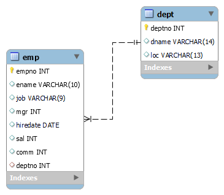
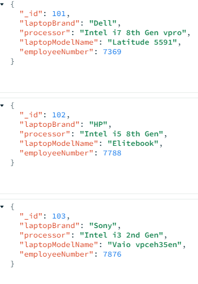

<h2>MongoDB and MySQL ORM Mapping with Spring Data JPA</h2>
<h5>Technology Used - </h5>
<ul>
	<li>SpringBoot 3.1.0</li>
	<li>Java - OpenJDK 17.0.2</li>
	<li>MySQL database</li>
	<li>MongDB - 6.0.6</li>
</ul>
<h4>ERD Diagram of Employee database</h4>

  

<h4>Collection Diagram of Computer database - MongoDB</h4>

  

<h4>API Documentation - </h4>
<h5><u>Fetch all employees data</u> </h5>

<u>Api Details:</u> Rest API to get 'employees' from MySQL database and their mapped 'laptop' from mongodb collection.

URL endpoint - {hostname}/employee/fetch-employees 
http method - "GET" 
produces only "application/json"
<pre>
responsebody -
{
    "error": false,
    "message": null,
    "data": [
        {
            "employeeNumber": 7369,
            "employeeName": "SMITH",
            "designation": "CLERK",
            "manager": 7902,
            "hireDate": "1980-12-17",
            "salary": 800,
            "commission": null,
            "department": {
                "departmentNumber": 20,
                "departmentName": "RESEARCH",
                "location": "DALLAS"
            },
            "assignedLaptop": {
                "_id": 101,
                "laptopBrand": "Dell",
                "laptopModelName": "Latitude 5591",
                "processor": "Intel i7 8th Gen vpro",
                "employeeNumber": 7369
            }
        },
        {
            "employeeNumber": 7499,
            "employeeName": "ALLEN",
            "designation": "SALESMAN",
            "manager": 7698,
            "hireDate": "1981-02-20",
            "salary": 1600,
            "commission": 300,
            "department": {
                "departmentNumber": 30,
                "departmentName": "SALES",
                "location": "CHICAGO"
            },
            "assignedLaptop": null
        },
        {
            "employeeNumber": 7566,
            "employeeName": "JONES",
            "designation": "MANAGER",
            "manager": 7839,
            "hireDate": "1981-04-02",
            "salary": 2975,
            "commission": null,
            "department": {
                "departmentNumber": 20,
                "departmentName": "RESEARCH",
                "location": "DALLAS"
            },
            "assignedLaptop": {
                "_id": 104,
                "laptopBrand": "MSI",
                "laptopModelName": "GL63 8RD-450IN",
                "processor": "Intel i7 8th Gen",
                "employeeNumber": 7566
            }
        }
    ]
}
</pre>
<h5><u>Fetch Employees by Department No.: </u></h5>

<u>Api Details:</u> Rest API to get 'employees' by their department number from MySQL database and their mapped 'laptop' from mongodb collection. 
URL endpoint - {hostname}/employee/fetch-employeesbydeptno?deptno={deptno} 
http method - "GET" 
example deptno = 20 
produces only "application/json"
<pre>
responsebody -
{
    "error": false,
    "message": null,
    "data": [
        {
            "employeeNumber": 7369,
            "employeeName": "SMITH",
            "designation": "CLERK",
            "manager": 7902,
            "hireDate": "1980-12-17",
            "salary": 800,
            "commission": null,
            "department": {
                "departmentNumber": 20,
                "departmentName": "RESEARCH",
                "location": "DALLAS"
            },
            "assignedLaptop": {
                "_id": 101,
                "laptopBrand": "Dell",
                "laptopModelName": "Latitude 5591",
                "processor": "Intel i7 8th Gen vpro",
                "employeeNumber": 7369
            }
        },
        {
            "employeeNumber": 7566,
            "employeeName": "JONES",
            "designation": "MANAGER",
            "manager": 7839,
            "hireDate": "1981-04-02",
            "salary": 2975,
            "commission": null,
            "department": {
                "departmentNumber": 20,
                "departmentName": "RESEARCH",
                "location": "DALLAS"
            },
            "assignedLaptop": {
                "_id": 104,
                "laptopBrand": "MSI",
                "laptopModelName": "GL63 8RD-450IN",
                "processor": "Intel i7 8th Gen",
                "employeeNumber": 7566
            }
        },
        {
            "employeeNumber": 7788,
            "employeeName": "SCOTT",
            "designation": "ANALYST",
            "manager": 7566,
            "hireDate": "1987-04-19",
            "salary": 3000,
            "commission": null,
            "department": {
                "departmentNumber": 20,
                "departmentName": "RESEARCH",
                "location": "DALLAS"
            },
            "assignedLaptop": {
                "_id": 102,
                "laptopBrand": "HP",
                "laptopModelName": "Elitebook",
                "processor": "Intel i5 8th Gen",
                "employeeNumber": 7788
            }
        }
    ]
}
</pre>
<h5><u>Fetch all laptop data</u> </h5>

<u>Api Details:</u> Rest API to get all 'laptop' from MongoDB collection.

URL endpoint - {hostname}/laptop/fetch-laptops 
http method - "GET" 
produces only "application/json"
<pre>
responsebody -
{
    "error": false,
    "message": null,
    "data": [
        {
            "_id": 101,
            "laptopBrand": "Dell",
            "laptopModelName": "Latitude 5591",
            "processor": "Intel i7 8th Gen vpro",
            "employeeNumber": 7369
        },
        {
            "_id": 102,
            "laptopBrand": "HP",
            "laptopModelName": "Elitebook",
            "processor": "Intel i5 8th Gen",
            "employeeNumber": 7788
        },
        {
            "_id": 103,
            "laptopBrand": "Sony",
            "laptopModelName": "Vaio vpceh35en",
            "processor": "Intel i3 2nd Gen",
            "employeeNumber": 7876
        }
    ]
}
</pre>